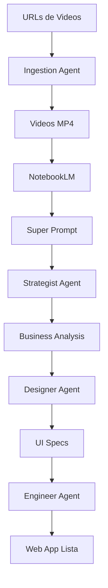

# 🏭 ORQUESTADOR - Multi-Agent Business Factory

## 🎯 Objetivo del Proyecto

Crear un sistema automatizado que transforma ideas de negocio (extraídas de videos de Instagram/YouTube) en aplicaciones web funcionales utilizando únicamente herramientas gratuitas.

---

## 🧠 Arquitectura Multi-Agente

El sistema está compuesto por **agentes especializados** que trabajan en secuencia:

### 1. 📥 **Ingestion Agent** (Recolector)
- **Ubicación**: `agents/ingestion/`
- **Función**: Descarga videos de Instagram/YouTube
- **Input**: Lista de URLs en `urls.txt`
- **Output**: Videos en formato MP4 en carpeta `downloads/`

### 2. 🧠 **Strategist Agent** (Estratega)
- **Ubicación**: `agents/strategist/`
- **Función**: Analiza contenido y extrae ideas de negocio
- **Herramienta**: NotebookLM (Google)
- **Prompts Opal**:
  - `opal_step_1_analysis.md` - Análisis de Oportunidad
  - `opal_step_2_plan.md` - Plan de Ejecución
  - `opal_step_3_design_prompts.md` - Diseño de Prompts
  - `opal_step_4_generate_log.md` - Log de Progreso

### 3. 🎨 **Designer Agent** (Diseñador)
- **Ubicación**: `agents/designer/`
- **Función**: Define la identidad visual y componentes UI
- **Prompts Opal**:
  - `opal_step_5_ui_design.md` - Especificación de UI

### 4. 👨‍💻 **Engineer Agent** (Ingeniero)
- **Función**: Construye la aplicación web real
- **Stack**: React + Vite + Vanilla CSS
- **Ejecutor**: Antigravity (Yo)

### 5. 📢 **Marketer Agent** (Marketing)
- **Función**: Genera copy para landing pages
- **Output**: Textos SEO-optimizados

---

## 🔄 Flujo de Trabajo Completo



### Paso a Paso

#### **FASE 1: Recolección de Contenido** ✅
1. Pegar URLs en `c:\Orquestador\agents\ingestion\urls.txt`
2. Ejecutar descarga:
   ```powershell
   cd c:\Orquestador\agents\ingestion
   python -m yt_dlp -a urls.txt -o "downloads/%(title).50s.%(ext)s" --merge-output-format mp4
   ```
3. Verificar archivos en `downloads/`

#### **FASE 2: Análisis Estratégico** (Próximo Paso)
1. Ir a [NotebookLM](https://notebooklm.google.com)
2. Crear nuevo proyecto
3. Subir TODOS los videos de `downloads/`
4. Copiar el contenido de `c:\Orquestador\notebooklm_super_prompt.md`
5. Pegar en NotebookLM y ejecutar
6. Copiar la respuesta (Business Analysis)

#### **FASE 3: Diseño y Construcción** (Automatizada)
1. Pegar el "Project Topic" de NotebookLM aquí (a Antigravity)
2. Antigravity ejecutará:
   - Análisis de Oportunidad
   - Plan de Ejecución
   - Diseño de UI
   - Construcción de la Web App
3. Output: Aplicación web funcional en `projects/business_01/`

#### **FASE 4: Despliegue** (Opcional)
- Render.com (gratis)
- Vercel (gratis)
- Netlify (gratis)

---

## 📁 Estructura de Archivos

```
c:\Orquestador/
├── README.md                          # Este archivo
├── config.yaml                        # Configuración del sistema
├── notebooklm_super_prompt.md        # Prompt optimizado para análisis
│
├── agents/
│   ├── ingestion/
│   │   ├── urls.txt                   # Lista de URLs a procesar
│   │   ├── harvest.py                 # Script de extracción (alternativo)
│   │   ├── download_videos.ps1       # Script de descarga rápida
│   │   └── downloads/                 # Videos descargados
│   │
│   ├── strategist/
│   │   ├── opal_step_1_analysis.md
│   │   ├── opal_step_2_plan.md
│   │   ├── opal_step_3_design_prompts.md
│   │   └── opal_step_4_generate_log.md
│   │
│   ├── designer/
│   │   └── opal_step_5_ui_design.md
│   │
│   ├── engineer/
│   │   └── (Antigravity en tiempo real)
│   │
│   └── marketer/
│       └── (Pendiente)
│
└── projects/
    ├── business_01/                   # Primer negocio generado
    ├── business_02/                   # Segundo negocio
    └── ...
```

---

## ⚙️ Requisitos Técnicos

### Instalados:
- ✅ Python 3.x
- ✅ `yt-dlp` (instalado via `pip install yt-dlp`)

### Necesarios para Siguiente Fase:
- Cuenta de Google (para NotebookLM)
- Navegador web

---

## 🚀 Estado Actual del Proyecto

### ✅ Completado:
1. Arquitectura Multi-Agente diseñada
2. Estructura de carpetas creada
3. Prompts de Opal extraídos y configurados
4. Super Prompt para NotebookLM optimizado
5. Scripts de ingestion creados

### 🔄 En Progreso:
- Descarga de videos de Instagram (15 URLs en `urls.txt`)

### ⏳ Pendiente:
1. Subir videos a NotebookLM
2. Ejecutar análisis con Super Prompt
3. Construir primera aplicación web

---

## 📝 Próximos Pasos INMEDIATOS

### Opción A: Automática (Recomendada)
```powershell
cd c:\Orquestador\agents\ingestion
New-Item -ItemType Directory -Force -Path downloads
python -m yt_dlp -a urls.txt -o "downloads/%(title).50s.%(ext)s" --merge-output-format mp4
```

### Opción B: Semi-Manual
1. Usa una herramienta externa como [SnapInsta](https://snapinsta.app/) para descargar los reels
2. Guarda todos en `c:\Orquestador\agents\ingestion\downloads\`
3. Continúa con FASE 2 (NotebookLM)

---

## 🆘 Solución de Problemas

### "yt-dlp no funciona con Instagram"
- Instagram bloquea scraping agresivamente
- **Solución**: Usa herramientas de terceros o extensiones de navegador para descargar
- **Alternativa**: Si los videos son públicos, copia el link y usa servicios web de descarga

### "La carpeta downloads no se crea"
- Verificar permisos en `c:\Orquestador`
- Ejecutar PowerShell como Administrador
- Crear manualmente: `mkdir c:\Orquestador\agents\ingestion\downloads`

---

## 💡 Filosofía del Proyecto

> "De 100 videos de estrategias online → A múltiples negocios digitales reales, usando solo herramientas gratuitas y AI."

La clave está en:
1. **Clustering**: Agrupar ideas similares
2. **Comparative Analysis**: Elegir las MEJORES herramientas gratuitas
3. **Automation**: Que Antigravity construya todo el código

---

## 📞 Contacto con Antigravity

Para continuar, simplemente dime:
- "Videos descargados" → Procederé a FASE 2
- "Tengo el análisis de NotebookLM" → Construiré la app
- "Ayuda con [X]" → Te guiaré en ese paso específico
